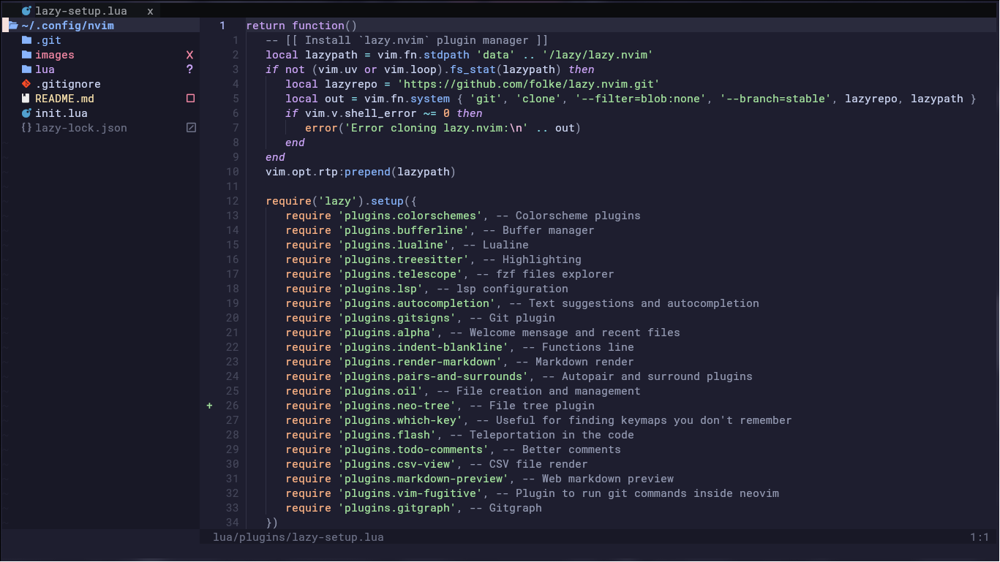

<h1 align="center">My Neovim Setup</h1>

This repository contains my Neovim configuration, including plugins, keymaps, and options that I find useful.

 
 

## Directory Structure

- **lua/** – Main Lua configuration:
    - **lua/core/** – Keymaps and core configuration files
    - **lua/plugins/** – Plugin configurations
    - **lua/todofloat/** – Custom floating TODO window plugin

## Installation

This setup is designed for Arch Linux. Some packages may not work on other distributions or operating systems (e.g., Windows).  
If you encounter issues, check the [Known Issues](#known-issues) section or contact me.

### Prerequisites

#### Python

Some Neovim plugins require Python. For Arch-based distros, install with:

```bash
sudo pacman -Syu
sudo pacman -S python python-pip
```

#### LaTeX

LaTeX highlighting requires extra packages. First, install Node.js and npm:

```bash
sudo pacman -Syu
sudo pacman -S nodejs npm
```

Then install tree-sitter-cli for LaTeX highlighting:

```bash
npm install -g tree-sitter-cli
```

### Setup Steps

1. Clone this repository and move all files to your Neovim configuration folder;
2. Remove the `.git` and `images` directories, `README.md` and `.gitignore` files;
3. Open Neovim, plugins will be installed automatically via Lazy.nvim.

#### Extra

If you encounter LSP installation errors, run `:MasonLog` in Neovim, follow the instructions, and install any missing packages.

## Known Issues

> [!BUG]
>
> **Windows 10:**  
> The TODO float plugin may not find the `todo.md` file on some PCs. It seems to be a path problem.

> [!SUCCESS]
>
> It's not the best solution, but since a few updates ago, you only need to create the todo.md file at ~/.config/nvim/lua/todofloat/ and it will work again.

## Final Notes

This configuration is tailored to my daily workflow, featuring essential plugins I find useful. Feel free to customize as you like.
