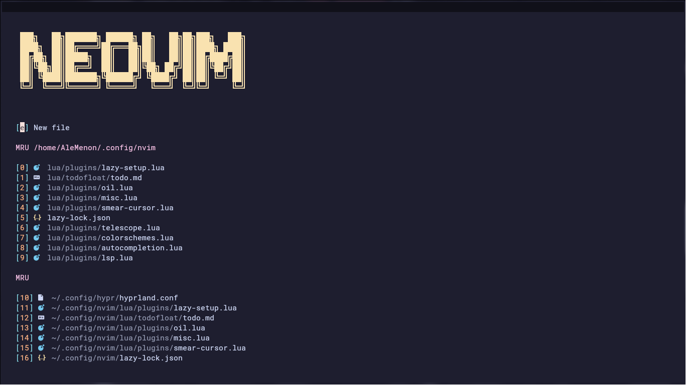
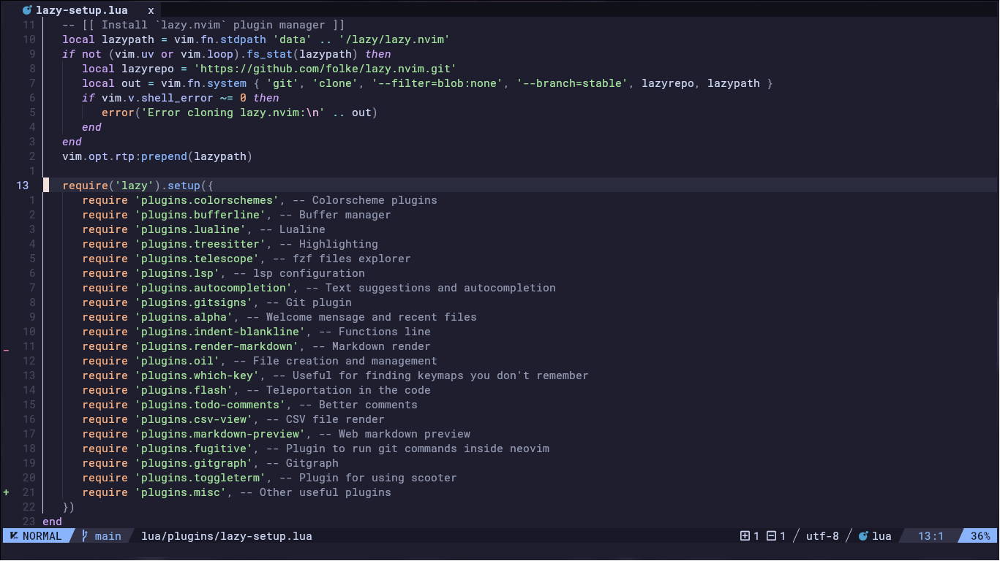
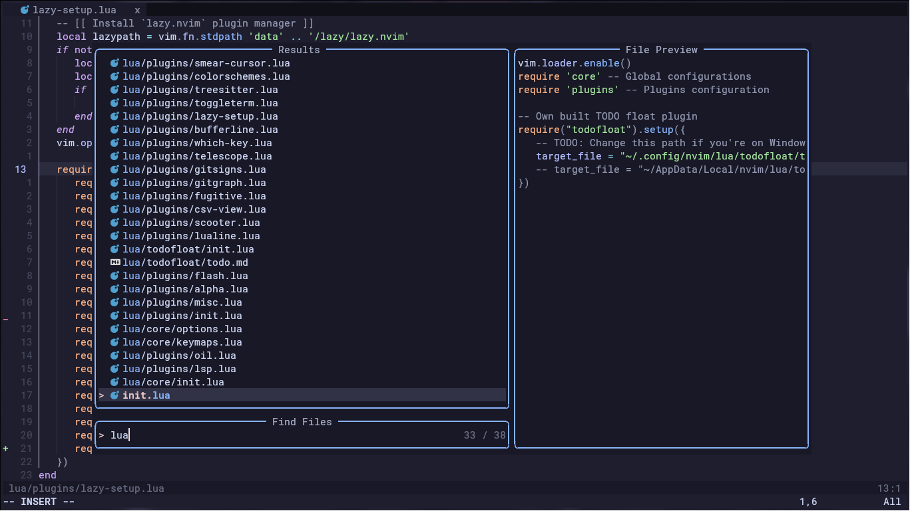

<h1 align="center">Neovim Config</h1>

This repository contains my Neovim configuration, including plugins, keymaps, and options that I find useful.

 
 
 

## Directory Structure

- **lua/** – Main Lua configuration:
    - **lua/core/** – Keymaps and core configuration files
    - **lua/plugins/** – Plugin configurations
    - **lua/todofloat/** – Custom floating TODO window plugin
- **lsp/** - Main lsp configurations overwrite

## Installation

This setup is primarily designed for Arch Linux, but it can also work on Windows with a few adjustments. See the [Extra](#extra) section for details.
If you encounter issues, check the [Known Issues](#known-issues) section or contact me.

### Prerequisites
---

#### Python

Some Neovim plugins require Python. For Arch-based distros, install with:

```bash
sudo pacman -Syu
sudo pacman -S python python-pip
```

#### Gcc and Make

Gcc and make are required to compile some dependencies. Install the necessary tools with:

```bash
sudo pacman -Syu
sudo pacman -S base-devel
```

On Windows, another step is needed for treesitter to work, run the command or just insert this line at the `$PROFILE` file:

```bash
$env:CC="gcc"
```

#### LaTeX

LaTeX highlighting requires extra packages. First, install Node.js and npm:

```bash
sudo pacman -Syu
sudo pacman -S nodejs npm
```

Then install tree-sitter-cli for LaTeX highlighting:

```bash
npm install -g tree-sitter-cli
```

#### Scooter

For the replace tool configuration found in the `scooter.lua` file inside **plugins/** folder, you'll need to install scooter CLI, see more about it in the [Scooter](https://github.com/thomasschafer/scooter) GitHub page.

#### Telescope Dependencies

For Telescope to work, `fd` and `ripgrep` are needed:

```bash
sudo pacman -Syu
sudo pacman -S fd ripgrep
```

#### Vim Plug

`Vim Plug` is a plugin manager used here to install plugins that do not have support for the `Lazy` package manager. Installation instructions can be found in the [Vim Plug](https://github.com/junegunn/vim-plug) GitHub page.

### Setup Steps
---

1. Clone this repository and move all files to your Neovim configuration folder;
2. Feel free to remove the `.git` and `images` directories, `README.md` and `.gitignore` files if you want;
3. Open Neovim, plugins will be installed automatically via Lazy.nvim;
4. Run `:PlugInstall` to install the plugins that uses Vim Plug as the installer.

#### Extra

1. If you encounter LSP installation errors, run `:MasonLog` in Neovim, follow the instructions, and install any missing packages.
2. Windows settings:
    - For todofloat plugin to work, change the path being passed as parameter in the `init.lua` file.
    - Icons being used in the GitGraph plugin aren't working on Windows, so simply comment the `symbols = {...}` section to use the default ones.
    - Files with things that need changing depending on the system you're in have a *TODO* comment right above them with instructions.

## Known Issues

> [!NOTE]
> There's no known issue until this moment

## Final Notes

This configuration is tailored to my daily workflow, featuring essential plugins I find useful. Feel free to customize as you like.
