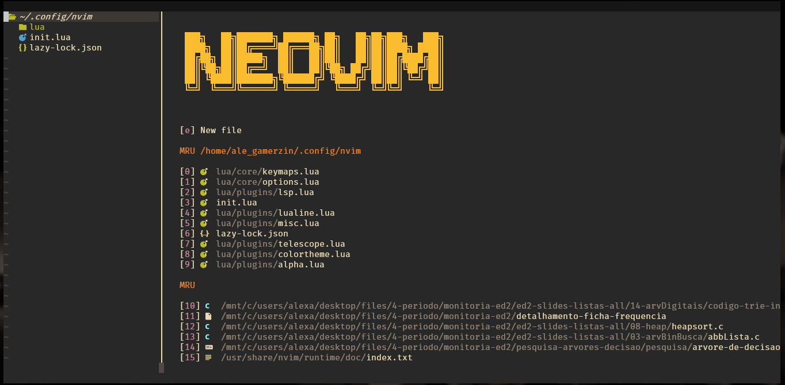

<h1 align=center>My Neovim Setup</h1>
This repository contains my Neovim setup, with all the plugins, keymaps and options that I found useful.

 



## Directory Content
- **nvim-shortcuts.txt** - This file contains the main commands from Neovim, and also the custom keymaps that are written in the lua/core/keymaps.lua file;
- **init.lua** - Default init file for Neovim configuration, **essential** for the configuration to work;
- **lua/** - Directory for the lua configuration:
    - **lua/core** - Keymaps and some other configuration files;
    - **lua/plugins** - All the installed plugins in their respective files.

## Installation
If you'd like to try this configuration, follow the steps below.
Also, if you encounter issues during installation, check the [Known issues](#known-issues) section or feel free to contact me.

### Prerequisites

> [!NOTE]
>These prerequisites are only needed if you want to have lsp support for LaTeX.<br>
>If you don't want it, follow the steps written in the [Optional LaTeX suport](#optional-latex-support) section.

1. First, install *nodejs* and *npm* in your machine. The commands below are for linux distros based on **Debian and Ubuntu**:

```bash
sudo apt update
sudo apt install nodejs npm
```

2. After installing everything, run the command:

```bash
npm install -g tree-sitter-cli
```

### Cloning and Configuring Neovim

After making sure everything is ready, follow the steps:
1. Clone the repository and then move all the files to the Neovim configuration folder;
2. Remove the .git directory;
3. Open Neovim and everything will be installed with Lazy.nvim.

### Optional LaTeX Support
If you don't want LaTeX support for your Neovim, follow these steps to remove it from your configuration:
- Remove the line that says `texlab={}` in the `local servers` function in the lua/plugins/lsp.lua file;
- Remove the 'latex' from the `ensure_installed` function in the lua/plugins/treesitter.lua file, if you also don't want text highlight for LaTeX files.

## Known Issues

>[!WARNING]
>For some reason, this configuration doesn't work with C files on Windows (atleast in my PC).
> The problem is that for some reason the lsp doesn't recognize functions from the standard libraries, like `printf()` , and also macros like `NULL`.
>If you find a solution, feel free to make a pull request or contact me on [LinkedIn](https://www.linkedin.com/in/alexandre-menon/).

## Final Considerations

This configuration was created to meet my daily needs, with all the essential plugins that I found useful. Feel free to change anything that you dislike or add new plugins.
